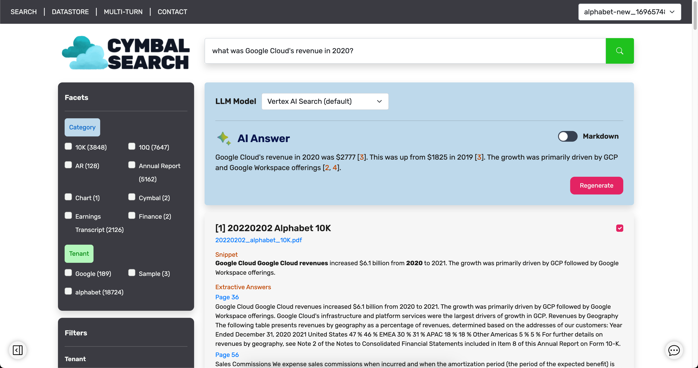
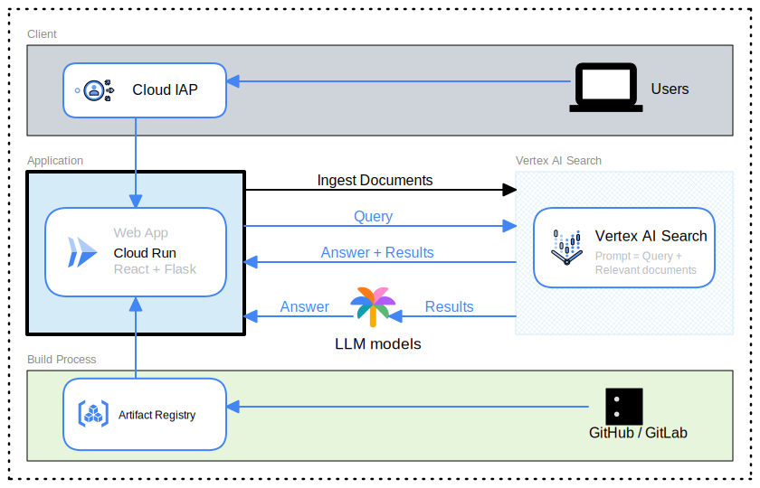

# Cymbal Search

### A [Vertex AI Search](https://cloud.google.com/generative-ai-app-builder?hl=en) Demo

- Try it here -> https://www.cymbalsearch.com (Controlled access)
- Bug sheet -> [go/cymbalsearch](https://docs.google.com/spreadsheets/d/1DrLq4csxe5kYvtIJh9u-iBsxmbU-5-qsO5Urcs-Pn7M/edit?usp=sharing)

<!-- <figure class="video_container">
  <video controls="true" allowfullscreen="true" poster="path/to/poster_image.png">
    <source src="Search.webm" type="video/webm">
  </video>
</figure> -->

### Video Walkthrough



Speed up 1.5x for optimal experience:

- [Search](https://www.youtube.com/watch?v=9uqgSKSuYFc)
- [Datastore](https://youtu.be/yykBUVQjQLs)
- [Multi-turn](https://youtu.be/nWrdlTJxn98)

## Table of Contents

- [Software Architecture Diagram](#software-architecture-diagram)
- [Pre-requisites](#pre-requisites)
  - [Google Cloud Project](#1-google-cloud-project)
  - [Vertex AI Search App](#2-vertex-ai-search-app)
  - [Google Cloud Storage](#3-google-cloud-storage)
- [Deploy to Cloud Run or App Engine](#deployment-instructions)
- [Local Development](#local-development)

## Software Architecture Diagram



## Pre-requisites

You need to set up a Google Cloud Project with a Vertex AI Search app (unstructured datastore) and a GCS bucket. With these set up, you can simply define the environment variables and run the Dockerfile anywhere to deploy your app.

### 1. Google Cloud Project

1. Create a [Google Cloud project](https://cloud.google.com/resource-manager/docs/creating-managing-projects) if you don't already have one.
2. Open the cloud shell and enter the following command
   ```
   git clone https://github.com/analyticsrepo01/search_tool.git
   ``` 
   ```
   cd cymbal-search-demo-main
   ```

### 2. Vertex AI Search App

Create a Vertex AI Search with unstructured datastore with defined metadata.

1. Go to [Agent Builder](https://console.cloud.google.com/gen-app-builder/engines) page and enable the api if prompted
2. Select 'Create app'
3. Select `Search`
4. At Configuration,
   1. Enable all features
   2. Set your App Name
   3. Set location as global
   4. Click `CONTINUE`
5. Create a new data store - select `Cloud Storage`
6. Create a new bucket in Cloud Storage called alphabet-public
7. Upload the alpha-metadata.json file in the root directory provided in this repository to the bucket root
8. At Data import, we will load a set of public PDFs using a JSON file:
   1. Select `FILE`
   2. In the gs:// textbox, input `cymbalsearch-alphabet-public/metadata/metadata.json`
   3. Select `Linked unstructured documents (JSONL with metadata)`
   4. Click `CONTINUE`
9. Give your data store a name and click `CREATE` (wait a few seconds for datastore to create)
10. Select your newly-created data store and click `CREATE` to create app
11. After around 10 minutes, the import status should show "Import completed".
12. Congratulations! Play around with the app in the Preview and Configurations tabs in the console.

### 3. Google Cloud Storage

Create a bucket to be used for uploading of new documents using the UI.

1. [Create a GCS bucket](https://cloud.google.com/storage/docs/creating-buckets#create_a_new_bucket) either in console or run this gcloud command in Cloud Shell after replacing the bucket name:
   ```
   export BUCKET_FOR_UPLOAD=$BUCKET_NAME
   ```
   ```
   gcloud storage buckets create gs://$BUCKET_FOR_UPLOAD
   ```
2. [Configure CORS](https://cloud.google.com/storage/docs/cors-configurations#command-line) for your bucket.
   ```
   echo '[{"origin": ["*"], "method": ["GET"], "responseHeader": ["Content-Type"],"maxAgeSeconds": 3600}]' > cors.json
   ```
   ```
   gsutil cors set cors.json gs://$BUCKET_FOR_UPLOAD
   ```

## Deployment Instructions

These instructions are suggested to be run in your GCP Project's [Cloud Shell](https://shell.cloud.google.com/?show=ide%2Cterminal).\
However, if you would like to run them locally, set up [Application Default Credentials (ADC)](https://cloud.google.com/docs/authentication/provide-credentials-adc#local-dev).

### 1. Clone this project repository

Follow [this guide](https://docs.gitlab.com/ee/user/profile/personal_access_tokens.html) to create your personal access token. Then substitute the <token_name> and <token_value> below and run the command to clone the repository.

```
git clone https://<token_name>:<token_value>@gitlab.com/google-cloud-ce/googlers/elroylbj/cymbal-search.git
```

### 2. Set environment variables

Please replace these with your project details:

- Add `ENGINE_2` and `ENGINE_3` if you want more apps.
- Leave `MODEL_1` and `MODEL_2` values unchanged if there are no changes to the PaLM models.

```
export PROJECT_ID="PROJECT_ID"
export BUCKET_FOR_UPLOAD="BUCKET_NAME"
export ENGINE_1="VERTEX_AI_SEARCH_DATASTORE_ID"
export MODEL_1="text-bison"
export MODEL_2="text-bison-32k"
```

Set deployment details (leave the default values at your convenience):

```
export APP_NAME=cymbalsearch
export SERVICE_ACC=cymbalsearch-sa
export REGION=asia-southeast1
export REPOSITORY=my-repo
export IMAGE=my-image
export TAG=1.0
```

- `REGION` is the regional or multi-regional location of the repository.
- `REPOSITORY` is the name of the repository where the image is stored.
- `IMAGE` is the name of the image in the repository.
- `TAG` is the tag of the image version that you want to pull.

### 3. Enable APIs, create Service Account and push Docker image to Artifact Registry

Firstly, ensure you are in the root directory of the repository, next, run the script below:

```
./deploy.sh
```

The `deploy.sh` script does the following:

1. Enable required APIs (requires the `roles/servicemanagement.serviceConsumer` role).
1. Create Service Account with required permissions (requires the `roles/iam.serviceAccountCreator` role).
1. Create Artifact Repository (requires the `roles/artifactregistry.admin` role).
1. Build image and push to Artifact Registry.

Visit the [Artifact Registry console](https://console.cloud.google.com/artifacts) to view your Docker image. It will take around 10 minutes for the build to complete.

### 4. Deploy your app on either Cloud Run or App Engine.

#### Option 1: [Cloud Run](https://cloud.google.com/run/docs/building/containers#building_using_a_dockerfile)

1. If you are running in an Argolis Project, overwrite the Organization Policy as seen [here](https://docs.google.com/document/d/1hkaIOJLsmOqpodfJ7o-sFYcgCqv4u3FdiSotdW-udhE/edit#heading=h.drhib175f9p4) to be able to `unauthenticated invocations`.
2. Deploy Cloud Run using the command below. Add ENGINE_2 and ENGINE_3 in the env vars if you want to.
   ```
   gcloud run deploy $APP_NAME \
       --image $REGION-docker.pkg.dev/$PROJECT_ID/$REPOSITORY/$IMAGE:$TAG \
       --region $REGION \
       --service-account=$SERVICE_ACC@$PROJECT_ID.iam.gserviceaccount.com \
       --allow-unauthenticated \
       --set-env-vars=PROJECT_ID=$PROJECT_ID,BUCKET_FOR_UPLOAD=$BUCKET_FOR_UPLOAD,ENGINE_1=$ENGINE_1,MODEL_1=$MODEL_1,MODEL_2=$MODEL_2
   ```

#### Option 2: [App Engine](https://cloud.google.com/artifact-registry/docs/integrate-app-engine#deploy)

1. Create a `app.yaml` file at the project root where the Dockerfile is located. See [yaml reference](https://cloud.google.com/appengine/docs/flexible/reference/app-yaml?tab=python) for more configurations.
   ```
   echo "runtime: custom
   env: flex
   env_variables:
       PROJECT_ID: $PROJECT_ID
       BUCKET_FOR_UPLOAD: $BUCKET_FOR_UPLOAD
       ENGINE_1: $ENGINE_1
       MODEL_1: $MODEL_1
       MODEL_2: $MODEL_2
   " > app.yaml
   ```
   Check that your env variables are reflected in the app.yaml:
   ```
   cat app.yaml
   ```
1. To deploy the app, run the following command from the directory where your app.yaml and Dockerfile are located:
   ```
   gcloud app deploy --image-url=$REGION-docker.pkg.dev/$PROJECT_ID/$REPOSITORY/$IMAGE:$TAG
   ```
1. To see your app running at `https://PROJECT_ID.REGION_ID.r.appspot.com`, run the following command to launch your browser:
   ```
   gcloud app browse
   ```

- If there are any permission errors, check which Service Account your app engine is using (likely App Engine default service account with Editor role). \
  Go to the [IAM page](https://console.cloud.google.com/iam-admin/) at console to ensure the Service Account has the following roles (for convenience, Editor role will solve the issue): 1. Discovery Engine Admin 1. Logs Writer 1. Storage Object User 1. Vertex AI User

## Local Development

All commands should be run at project root directory.

1. Download required software and set to PATH.

   - Download [Python](https://www.python.org/downloads/) (3.11.4)
   - Download [npm (9.7.1) and node (v18.16.1)](https://docs.npmjs.com/downloading-and-installing-node-js-and-npm)

1. Set your GCP Project environment variables.
   ```
   export PROJECT_ID="Project ID"
   export BUCKET_FOR_UPLOAD="GCS Bucket name for document upload"
   export ENGINE_1="Vertex AI Search Engine ID"
   export ENGINE_2="Vertex AI Search Engine ID of a 2nd app (if any)"
   export ENGINE_3="Vertex AI Search Engine ID of a 3rd app (if any)"
   export MODEL_1="text-bison"
   export MODEL_2="text-bison-32k"
   ```
1. Set up [Application Default Credentials (ADC)](https://cloud.google.com/docs/authentication/provide-credentials-adc#local-dev) for your local development environment.

   1. [Install and initialize the gcloud CLI](https://cloud.google.com/sdk/docs/install).
   1. Login with your Google Cloud user credentials:
      ```
      gcloud auth application-default set-quota-project <PROJECT_ID>
      gcloud auth application-default login
      gcloud config set project <PROJECT_ID>
      ```

1. Install Python dependencies.

   ```
   python -m venv env
   source env/bin/activate
   pip install -r backend/requirements.txt
   ```

1. Run Python backend.

   ```
   python backend/app.py
   ```

1. Open another terminal and install the React dependencies.

   ```
   npm install
   ```

1. Run the React app.

   ```
   npm start
   ```

   Open [http://localhost:3000](http://localhost:3000) to access your app with Hot Reload capabilities to develop your app dynamically.

## Getting Started with Create React App and Redux

This project was bootstrapped with [Create React App](https://github.com/facebook/create-react-app), using the [Redux](https://redux.js.org/) and [Redux Toolkit](https://redux-toolkit.js.org/) template.

You can learn more in the [Create React App documentation](https://facebook.github.io/create-react-app/docs/getting-started).

To learn React, check out the [React documentation](https://reactjs.org/).

Read and modify to change the `env.sh` file to suite your project details and GCS bucket

### Service Account Creation

Create a service account key and store in the root directory of this project and name it `key.json`

#### Build the container

docker build --platform linux/amd64 -t <container_name> .

`--platform` flag is provided to avoid compatibility issues when building container images on apple silicons

#### Tag docker container image (repository name is the name of the repository created on Google Cloud Artifact Registry)

docker tag `<container_name>` us-docker.pkg.dev/`<project_name>`/`<repository_name>`/`<conainer_name>:<container_tag>`

#### Push container image to artifact registry

docker push us-docker.pkg.dev/`<project_name>`/`<repository_name>`/`<conainer_name>:<container_tag>`

### Cloud Run for deployment

- Go to cloud run inside Google Cloud
- Create a cloud run instance
- Select the artifact registry & ensure to select the latest version of the container image
- Leave the options to default and ensure to allow Unauthenticated access (public url if necessary)
- Use the Cloud Run public URL generated
  > > > > > > > b583e5175b824df4c235e50734b88689aa72b4d7
